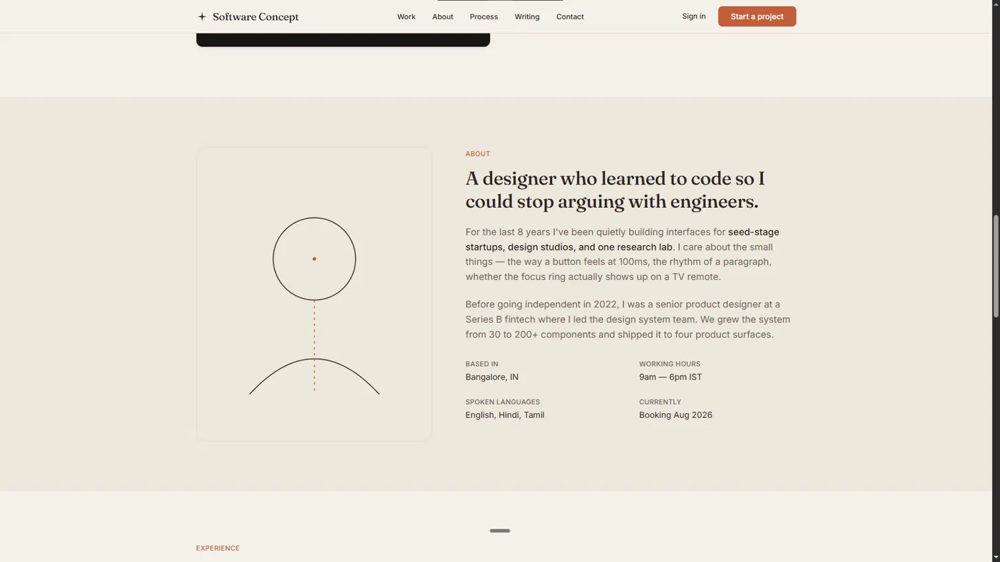
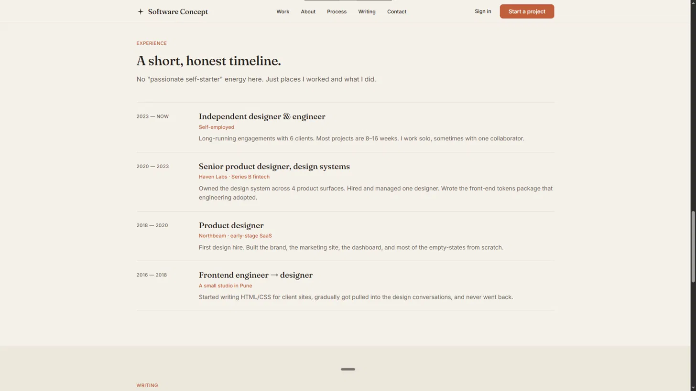

# Software Concept — Designer & Engineer Portfolio

Live: https://software.akshaycodecrafter.workers.dev/


## Preview

*The hero — headline, intro line, and the two CTAs.*


*Selected work cards — Ledgerbloom, Soundtrail, and Greywood Studio.*


*"How I work" — a code-editor mockup paired with a short explanation of the process.*


*The About section — background, working hours, spoken languages, and current availability.*


*The Experience timeline — a short, honest work history.*


*The closing CTA and footer — a direct email link, CV link, and site navigation.*

## Table of Contents
- [About](#about)
- [What's on the Page](#whats-on-the-page)
- [Built With](#built-with)
- [Why I Built It This Way](#why-i-built-it-this-way)
- [Running It Locally](#running-it-locally)
- [Status](#status)
- [Credits](#credits)
- [License](#license)

## About
A minimalist personal portfolio concept for a designer-engineer hybrid. I wanted to try building a site that felt more like a quiet, well-edited magazine page than a typical "hire me" portfolio — warm neutral background, one serif for headings, restrained use of an accent color, and no hero video or big illustration doing the heavy lifting.

_Tested on Chrome, Firefox, and Safari — fully responsive down to 375px._

Live: https://softwareconcept.example.com/

## What's on the Page
- **Hero** — a single headline, a short intro line, two CTAs
- **Work** — selected project cards, kept short on purpose
- **About** — a short bio plus a small meta list (location, working hours, languages, current availability)
- **Process / Experience** — an honest, no-fluff timeline of past roles instead of a generic "skills" list
- **Writing** — preview cards for blog-style posts
- **Contact** — a direct email CTA and a CV link, no contact form

## Built With
- HTML5, CSS3, JavaScript (vanilla — no framework)
- Scroll-reveal animations using the native IntersectionObserver API
- CSS custom properties for the whole theme (colors, spacing scale, radius, shadows) so the palette can be swapped from one place
- A small sticky-nav script that adds a border on scroll
- Fully responsive, with a simple mobile nav toggle

## Why I Built It This Way
Most portfolio templates lean on big gradients or a hero video to feel "premium." I wanted to see if restraint could do the same job — type, spacing, and one accent color, nothing else fighting for attention. The part that took the longest wasn't the layout, it was the scroll-reveal timing. My first attempt revealed everything the moment it was 1% in view, which looked jumpy on a fast scroll, so I ended up tweaking the IntersectionObserver's rootMargin and threshold a few times until the stagger actually felt calm instead of laggy.

## Running It Locally
```bash
git clone <your-own-repo-url-here>
cd software-concept
# just open index.html in your browser — no build step needed
```

## Status

Demo / concept build. Contact details, work history, and external links are illustrative and not tied to a real business or person.

## Credits
- Fonts: [Fraunces](https://fonts.google.com/specimen/Fraunces) and [Inter](https://fonts.google.com/specimen/Inter) via Google Fonts

## License
This project is licensed under the MIT License — see the LICENSE file for details.
